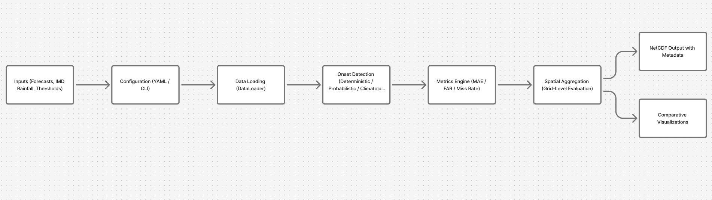
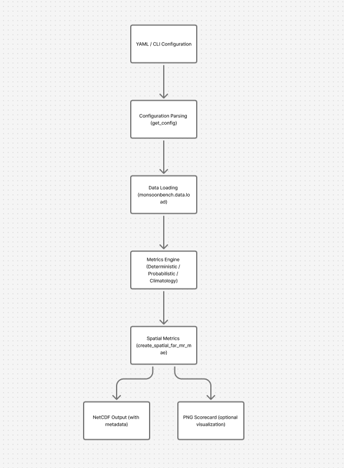

# MonsoonBench

MonsoonBench is a reproducible benchmarking framework for Indian monsoon onset prediction. It provides standardized data loaders, evaluation metrics, configuration management, and visualization tools for assessing deterministic, probabilistic, and climatology-based forecasting models. The project builds on ideas from WeatherBench while offering a modular, installable, and user-friendly workflow tailored to the monsoon onset task.

## Overview

MonsoonBench is designed as an installable Python package with a unified evaluation engine and an optional interactive GUI. It standardizes:

- Data loading for IMD rainfall, forecast outputs, and geographic shapefiles  
- Deterministic and probabilistic onset evaluations, and a climatology baseline  
- Modular onset detection algorithms  
- Grid-level and region-based scoring  
- YAML-based reproducible configurations  
- Visualization and diagnostic tools  

The goal is to support reproducible research, model development, and operational benchmarking for monsoon forecasting.

## High-Level Workflow



Typical flow:  
Inputs (forecasts, IMD rainfall, thresholds)  
→ Configuration (YAML or CLI)  
→ DataLoader  
→ Onset detection  
→ Metrics engine  
→ Spatial aggregation  
→ NetCDF output 

## Features

- CLI-based end-to-end benchmark execution  
- Modular dataset loaders with registry system  
- Deterministic, probabilistic, and climatology onset metrics  
- Spatial evaluation using MAE, False Alarm Rate, and Miss Rate  
- NetCDF output with metadata  
- Optional spatial scorecard plot generation  
- Config-driven reproducibility via YAML   

---

# Quick Start

## Installation

MonsoonBench is currently published on TestPyPI for pre-release testing.  
You can install version `0.1.0` using:

```bash
pip install -i https://test.pypi.org/simple/ \
    --extra-index-url https://pypi.org/simple/ \
    monsoonbench==0.1.0
```

This command tells pip to look for the package on TestPyPI first, and fall back to the main PyPI index for dependencies.

After installation, verify that the CLI is available:

```bash
monsoonbench --help
```

This will display the available commands, required configuration options, and default settings.

## Pipeline Workflow 

MonsoonBench’s CLI pipeline follows a clear sequence of steps from configuration to outputs.

1. Parse configuration  
   - `monsoonbench.config.get_config()` reads a YAML file (if provided) and merges it with CLI arguments.  
   - Command-line flags override YAML values.  

2. Initialize data loading  
   - `monsoonbench.data.load()` creates a DataLoader (for example, `imd_rain`).  
   - IMD rainfall and other inputs are loaded as `xarray` objects (typically `DataArray` named `tp`).  
   - Optional subsetting and chunking (time, lat, lon) can be applied.

3. Select metrics engine  
   - Based on `model_type`:
     - `DeterministicOnsetMetrics`  
     - `ProbabilisticOnsetMetrics`  
     - `ClimatologyOnsetMetrics`  
   - Shared interface methods are used to compute onset and metrics.

4. Compute onset metrics across years  
   - For deterministic/probabilistic models:  
     - `compute_metrics_multiple_years(...)` calculates onset and skill metrics over specified years, forecast windows, and tolerances.  
   - For climatology:  
     - `compute_climatology_baseline_multiple_years(...)` computes the climatological baseline and related metrics.

5. Build spatial metrics  
   - `create_spatial_far_mr_mae(...)` converts per-grid or per-year metrics into gridded fields of:
     - Mean Absolute Error (MAE)  
     - False Alarm Rate (FAR)  
     - Miss Rate (MR)

6. Save standardized outputs  
   - Spatial metrics are wrapped in an `xarray.Dataset`.  
   - Attributes record:
     - model type  
     - years  
     - tolerance days  
     - forecast windows  
     - MOK settings, etc.  
   - Dataset is saved to disk with `to_netcdf(output_file)`.
   
7. Print summary statistics  
   - Command-line output summarizes overall mean MAE, FAR, and Miss Rate to give a quick performance snapshot.

      

